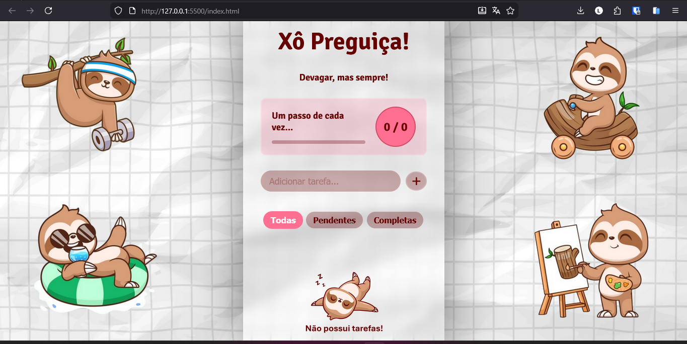
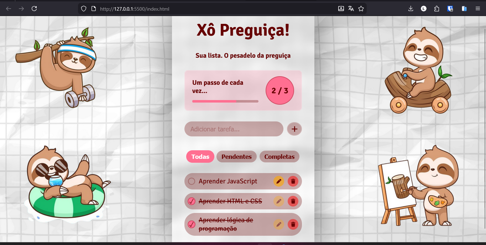
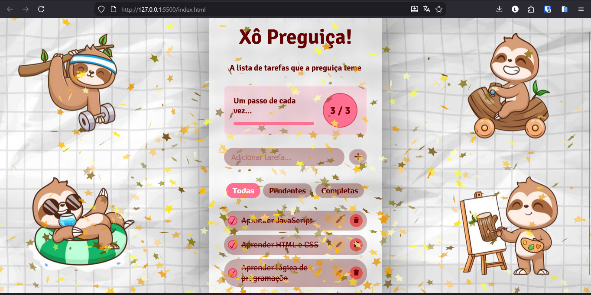

# Xô Preguiça - Lista de Tarefas

**Xô Preguiça** é uma Aplicação Web de Lista de Tarefas (To-Do App) pra te ajudar a organizar suas tarefas diárias.

## ✨ Funcionalidades

-   **Adicionar Tarefas** - Crie novas tarefas facilmente clicando em + ou pressionando Enter.
-   **Marcar como Concluído** - Checkbox interativo com feedback visual imediato.
-   **Editar Tarefas** - Modifique tarefas existentes com facilidade.
-   **Deletar Tarefas** - Remova tarefas da lista.
-   **Filtragem por Status** - Visualize a lista completa, apenas tarefas pendentes ou apenas as completadas.
-   **Ordenação Inteligente** - Tarefas pendentes sempre aparecem no topo, e as completadas no final da lista, independentemente do filtro ativo.
-   **Barra de Progresso** - Acompanhe o progresso em tempo real com uma barra de status.
-   **Armazenamento Local** - Tarefas são salvas no localStorage, garantindo que persistam entre as sessões.
-   **Efeito Visual de Celebração** - Confete aparece na tela ao completar todas as tarefas.
-   **Responsividade** - Funciona perfeitamente em desktop, tablet e mobile.


## 📁 Estrutura do Projeto

```
to-do_app/
├── index.html              # Estrutura HTML do app
├── styles.css              # Estilos responsividade
├── scripts.js              # Lógica funcionalidades
├── README.md               # Este arquivo
├── LICENSE.md              # Licença MIT
└── img/       
    ├── screenshot-1.png    
    ├── screenshot-2.png 
    ├── screenshot-3.png     
    ├── preguiça-dormindo.png 
    └── fundo.png      
```

## 🛠️ Tecnologias Utilizadas

- **HTML5** - Estrutura semântica, formulários e manipulação do DOM
- **CSS3** - Flexbox, Grid, media queries, animações e efeitos visuais
- **JavaScript Vanilla** - Eventos, manipulação do DOM, localStorage e lógica funcional

## 📚 Objetivo de Aprendizado

Este é um projeto pessoal criado para aprender e praticar:

- **HTML5** - Estrutura semântica, formulários e manipulação do DOM
- **CSS3** - Flexbox, Grid, media queries, animações e efeitos visuais
- **JavaScript Vanilla** - Eventos, manipulação do DOM, localStorage e lógica funcional


## 🚀 Como Usar

1. **Clone o repositório** ou baixe os arquivos:
   ```bash
   git clone https://github.com/larissakruger/to-do-sloth.git
   cd to-do_app
   ```

2. **Abra o arquivo**:
   - Localize `index.html` e abra no navegador (duplo clique ou clique direito → Abrir)

3. **Use o app**:
   - Digite uma tarefa no campo de entrada
   - Clique no botão "+" ou pressione **Enter** para adicionar
   - Use os ícones para:
     - ✏️ **Editar** - modifique o texto da tarefa
     - 🗑️ **Deletar** - remova a tarefa
     - ☑️ **Checkbox** - marque como concluída

4. **Veja seu progresso**:
   - A barra de progresso atualiza em tempo real
   - Quando todas as tarefas são concluídas, confete é acionado! 🎉

## 💾 Armazenamento

As tarefas são salvas automaticamente no `localStorage` do navegador:
-  Tarefas persistem mesmo após recarregar a página
-  Cada navegador/dispositivo tem seu próprio armazenamento
- ⚠️ Limpar dados do navegador apagará as tarefas


## 📸 Screenshots

<p align="center">
  
</p>

<p align="center">
  <strong>Adicione todas as suas tarefas, marque progresso e acompanhe o desempenho com a barra interativa.</strong>
</p>

<p align="center">
  
</p>

<p align="center">
  <strong>Edite, delete ou marque tarefas como concluídas facilmente. Interface intuitiva e responsiva.</strong>
</p>

<p align="center">
  
</p>

<p align="center">
  <strong>Confete anima ao completar todas as tarefas! Celebre ter vencido a preguiça!</strong>
</p>
